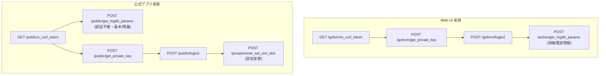

# +F FS050W Web API 開発者向け仕様書 (完全確定版)

**対象機器**: 富士ソフト製 5G モバイルルーター +F FS050W  
**メーカー**: MEIG INCORPORATED (FUJISOFT OEM)  
**デフォルトIP**: `192.168.100.1` (または接続中Wi-FiのDHCPデフォルトゲートウェイ)  
**通信プロトコル**: HTTP/1.1 (Port 80) / HTTPS (Port 443)  
**データフォーマット**: JSON / UTF-8

---

## 1. 接続状態別パラメータマトリクス

> **【重要】キャリアアグリゲーション (CA) 情報の取得制限について**
> 実機での検証の結果、フロントエンドにはCA情報取得用のコードが存在するものの、ルーター本体のバックエンドAPI（`/action/mnet_get_ca_list`）は **HTTP 404 Not Found** を返却します。
> また、`get_mgdb_params` からもCA関連パラメータ（`mnet_ca_mode`, `mnet_ca_list` 等）は返却されません。
> したがって、現在のファームウェアではAPI経由でのCA状態の判定は不可であり、システム上は常に「CAなし (単一キャリア接続)」として扱われます。

| 接続状態・条件                                      |    モード     |   LTE (MCG) 側   |  NR (SCG) 側  | 状態の解説                                 |
| :-------------------------------------------------- | :-----------: | :--------------: | :-----------: | :----------------------------------------- |
| **LTE 単独 (CAなし)**<br>`sysmode=="lte"`           |     `LTE`     |    `LTE (B3)`    |    非表示     | 通常の LTE 接続                            |
| **LTE-Advanced (CAあり)**<br>_(※API判定不可)_       |    `LTE-A`    | `LTE-A (B3+...)` |    非表示     | _(CA検知不可のため表示不可)_               |
| **EN-DC 待機 (NSA)**<br>`sysmode=="nsa"` & ENDC=`0` | `EN-DC Ready` |    `LTE (B3)`    | `待機中 (--)` | EN-DC (5G NSA) エリアで LTE 接続にて待機中 |
| **EN-DC 接続 (NSA)**<br>`sysmode=="nsa"` & ENDC確立 |    `EN-DC`    |    `LTE (B3)`    |  `NR (n77)`   | EN-DC (5G NSA) 通信中                      |
| **NR Standalone (SA)**<br>`sysmode=="nr5g"`         |    `NR SA`    |      非表示      |  `NR (n77)`   | NR SA (Standalone) 通信中                  |

---

## 2. API エンドポイント体系

FS050W には **Web UI向け（`/goform/`, `/action/`）** と **公式アプリ向け（`/public/`, `/private/`）** の2つのAPIルーティング体系が存在します。



### (1) CSRF トークン取得

- **公式アプリ用**: `GET /public/x_csrf_token`
- **Web UI用**: `GET /goform/x_csrf_token`
- **認証**: 不要
- **レスポンスヘッダー**: `X-Csrf-Token: <token_string>`, `Set-Cookie: -webs-session-=<session_id>; ...`
  _(※注記: POSTリクエスト毎にトークンが消費されるため、POST直前に毎回取得が必要)_

### (2) パブリック パラメータ取得 API (公式アプリ仕様・認証不要)

- **エンドポイント**: `POST /public/get_mgdb_params`
- **認証**: 不要 (`X-Csrf-Token` のみ必要)
- **リクエストボディ**:
  ```json
  {
    "keys": [
      "device_battery_level_percent",
      "device_battery_charge_status",
      "device_battery_exist",
      "mnet_operator_name",
      "mnet_sysmode",
      "mnet_sig_level_num",
      "statistics_current_month_used",
      "mnet_sim_slot"
    ]
  }
  ```
- **用途**: バッテリー残量(%)、充電ステータス、アンテナ本数、SIM状態、当月/当日通信量などをログインなしで即時取得。

### (3) 一時暗号鍵 (prikey) 取得

- **エンドポイント**: `POST /public/get_private_key` (または `POST /goform/get_private_key`)
- **ボディ**: `None` または `{}`
- **レスポンス**: `{"prikey": "xxxxxx", "retcode": 0}`

### (4) ログイン認証アルゴリズム (HMAC-MD5 チャレンジレスポンス)

- 固定ソルト: `key = "0123456789"`
- プレフィックス: `"4cc68e3626e5b94602c325f7c4ca5dee:example.com:"`
  $$\text{h1} = \text{HMAC-MD5}(\text{key}, \text{password})$$
  $$\text{p1} = \text{MD5}(\text{"4cc68e3626e5b94602c325f7c4ca5dee:example.com:"} + \text{h1})$$
  $$\text{p2} = \text{HMAC-MD5}(\text{key}, \text{p1} + \text{prikey})$$

- **エンドポイント**: `POST /public/login2` (または `POST /goform/login2`)
- **ボディ**: `{"username": "4cc68e3626e5b94602c325f7c4ca5dee", "password": p2, "prikey": prikey}`
- **レスポンス**: `{"retcode": 0}` (ヘッダーに `Set-Cookie` と `X-MG-Private` が返却)

### (5) プライベート設定変更 API (認証必須)

- **SIMスロット切り替え**: `POST /private/mnet_set_sim_slot`
  - ボディ: `{"mnet_sim_slot": "1"}` (1: SIM1 / 2: SIM2/eSIM)
- **詳細パラメータ取得**: `POST /action/get_mgdb_params`
  - ボディ: `{"keys": ["mnet_rsrp", "mnet_sinr", "mnet_wnw_band", "mnet_wnw_pci", "mnet_wnw_earfcn", ...]}`

---

## 3. 主要パラメータ一覧 & 規格変換式

| パラメータ名                 | API Key                            | 未認証 (`/public/`) | 認証済 (`/action/`) | 規格変換式 / 返却値の例                             | 単位  |
| :--------------------------- | :--------------------------------- | :-----------------: | :-----------------: | :-------------------------------------------------- | :---: |
| **System Mode**              | `mnet_sysmode`                     |          ◯          |          ◯          | 文字列 (`"lte"`, `"nsa"`, `"nr5g"`)                 |   -   |
| **PLMN (Operator)**          | `mnet_operator_name`               |          ◯          |          ◯          | 文字列 (`"Rakuten"`, `"au"` 等)                     |   -   |
| **アンテナピクト**           | `mnet_sig_level_num`               |          ◯          |          ◯          | `"0"` 〜 `"5"` (電波レベル本数)                     |  本   |
| **LTE RSRP**                 | `mnet_rsrp`                        |          ◯          |          ◯          | $\text{Raw} - 141$ _(NR SA時は $\text{Raw} - 157$)_ |  dBm  |
| **LTE RSSI**                 | `mnet_rssi`                        |          ◯          |          ◯          | $\text{Raw} - 111$                                  |  dBm  |
| **LTE RSRQ**                 | `mnet_rsrq`                        |          ✕          |          ◯          | $(\text{Raw} - 40) / 2$                             |  dB   |
| **LTE SINR**                 | `mnet_sinr`                        |          ✕          |          ◯          | 浮動小数そのまま                                    |  dB   |
| **LTE Operating Band**       | `mnet_wnw_band`                    |          ✕          |          ◯          | `"B" + val` (例: `"3"` $\to$ `B3`)                  |   -   |
| **LTE PCI**                  | `mnet_wnw_pci`                     |          ✕          |          ◯          | 整数 (例: `29`, `188`)                              |   -   |
| **LTE EARFCN**               | `mnet_wnw_earfcn`                  |          ✕          |          ◯          | 整数 (例: `1750`)                                   |   -   |
| **NR RSRP**                  | `mnet_endc_rsrp`                   |          ◯          |          ◯          | $\text{Raw} - 157$ _(待機時は `0` $\to$ `--`)_      |  dBm  |
| **NR RSRQ**                  | `mnet_endc_rsrq`                   |          ✕          |          ◯          | $(\text{Raw} - 1) / 2 - 43$ _(待機時は `--`)_       |  dB   |
| **NR SINR**                  | `mnet_endc_snr`                    |          ✕          |          ◯          | $(\text{Raw} - 1) / 2 - 23$ _(187.5dBバグ補正)_     |  dB   |
| **NR Operating Band**        | `mnet_wnw_psband`                  |          ✕          |          ◯          | `"n" + val` (例: `"77"` $\to$ `n77`)                |   -   |
| **NR PCI**                   | `mnet_wnw_pspci`                   |          ✕          |          ◯          | 整数 (例: `723`)                                    |   -   |
| **NR-ARFCN**                 | `mnet_wnw_psnrarfcn`               |          ✕          |          ◯          | 整数 (例: `650000`)                                 |   -   |
| **バッテリー残量 (%)**       | `device_battery_level_percent`     |          ◯          |          ◯          | `"0"` 〜 `"100"`                                    |   %   |
| **充電ステータス**           | `device_battery_charge_status`     |          ◯          |          ◯          | `"charging"` (充電中), `"discharging"` 等           |   -   |
| **バッテリー装着有無**       | `device_battery_exist`             |          ◯          |          ◯          | `"present"` (装着), `"none"` 等                     |   -   |
| **バッテリーレベル (0~4)**   | `device_battery_level`             |          ✕          |          ◯          | `"0"` 〜 `"4"` (バー数)                             |   -   |
| **バッテリー容量**           | `device_battery_capacity`          |          ✕          |          ◯          | 整数 (例: `"4000"`)                                 |  mAh  |
| **バッテリー電圧**           | `device_battery_voltage`           |          ✕          |          ◯          | 整数 (例: `"4036"`)                                 |  mV   |
| **バッテリー電流**           | `device_battery_current`           |          ✕          |          ◯          | 整数 (例: `"299"`)                                  |  mA   |
| **バッテリー温度**           | `device_battery_temperature`       |          ✕          |          ◯          | 整数 (例: `"38"`)                                   |   ℃   |
| **いたわり充電設定**         | `device_charge_long_life`          |          ◯          |          ◯          | `"enable"` または `"disable"`                       |   -   |
| **省電力モード**             | `device_power_saving_mode`         |          ◯          |          ◯          | `"eco"`, `"normal"` 等                              |   -   |
| **動作モード**               | `device_op_mode`                   |          ◯          |          ◯          | `"mobile"`, `"car"`, `"home"` 等                    |   -   |
| **選択中SIMスロット**        | `mnet_sim_slot`                    |          ◯          |          ◯          | `"1"` (物理SIM1), `"2"` (SIM2/eSIM)                 |   -   |
| **SIM1 / SIM2 状態**         | `mnet_sim_card1_state` / `2`       |          ◯          |          ◯          | `"1"`: 装着/有効, `"0"`: 未装着                     |   -   |
| **eSIM有効状態**             | `esim_enable`                      |          ◯          |          ◯          | `"1"`: 有効, `"0"`: 無効                            |   -   |
| **当月通信量 (SIM/eSIM)**    | `statistics_current_month_used`    |          ◯          |          ◯          | バイト数文字列 (Byte)                               | Bytes |
| **当日通信量 (SIM/eSIM)**    | `data_usage_one_day_sim` / `_esim` |          ◯          |          ◯          | バイト数文字列 (Byte)                               | Bytes |
| **トータル通信量**           | `data_usage_total_sim` / `_esim`   |          ◯          |          ◯          | バイト数文字列 (Byte)                               | Bytes |
| **Wi-Fi SSID (2.4G/5G)**     | `wifi_ssid_0` / `_1` / `_2`        |          ◯          |          ◯          | SSID文字列                                          |   -   |
| **Wi-Fi 接続台数**           | `wifi_client_0` / `_1` / `_2`      |          ◯          |          ◯          | 接続中のクライアント端末数                          |  台   |
| **端末IMEI**                 | `device_imei`                      |          ◯          |          ◯          | 15桁の端末識別番号                                  |   -   |
| **ファームウェアバージョン** | `device_software_version`          |          ◯          |          ◯          | 例: `"V2.0.11"`                                     |   -   |

---

## 4. 周波数帯 & 中心周波数 (MHz) 算出式 (3GPP 規格準拠)

- **LTE EARFCN $\to$ 中心周波数 (3GPP TS 36.101)**:
  - Band 3: $1805 + 0.1 \times (\text{EARFCN} - 1200)\text{ MHz}$ _(例: EARFCN 1750 $\to 1860.0\text{ MHz}$ / 1.7GHz帯)_
  - Band 1, 8, 18, 19, 21, 26, 28, 41, 42 計算式内蔵。
- **NR-ARFCN $\to$ 中心周波数 (3GPP TS 38.104)**:
  - Sub-6GHz 帯 (n77, n78, n79): $3000 + 0.015 \times (\text{ARFCN} - 600000)\text{ MHz}$ _(例: ARFCN 650000 $\to 3750.0\text{ MHz}$)_
  - Sub-3GHz 帯 (n28, n3, n1): $0 + 0.005 \times (\text{ARFCN} - 0)\text{ MHz}$ _(例: 700MHz帯)_

---

## 5. ポーリングレート・モデム更新頻度 & リフレッシュレート特性 (実機ベンチマーク確定仕様)

### (1) API サーバーの応答限界 (HTTP / Web サーバー層の実測値)

- **往復遅延 (RTT)**: 1リクエスト（Token取得 + POST取得）あたりの平均所要時間は **`12.38 ms`**（最小 `8.53 ms` / 最大 `33.27 ms`）。
- **最大処理スループット**: **`80.6 req/sec`**。
- **スロットリング**: 50ms以下の超高頻度で連続ポーリングを行っても、429 Too Many Requests やコネクション切断は発生せず安定して応答します。

### (2) パラメータ別の実測最小変化間隔 (モデム物理層 / mgdb 更新周期)

通信トラフィック負荷試験下において、各パラメータの値が実際に変化した最短時間間隔の実測データです。

| パラメータ種別          | 該当パラメータ                                     |     実測最小変化間隔      | 平均変化間隔  | 特性と内部仕様                                                              |
| :---------------------- | :------------------------------------------------- | :-----------------------: | :-----------: | :-------------------------------------------------------------------------- |
| **品質・雑音比 (最速)** | `mnet_sinr`                                        | **`1004.8 ms` (約1.0秒)** |   約 4.0 秒   | 物理層の測定値が **最短1秒周期** で内部更新されます。                       |
| **電波強度 (平滑化)**   | `mnet_rsrp`, `mnet_rsrq`, `mnet_rssi`              |     約 3.0 〜 5.0 秒      | 約 5.0 秒以上 | モデム内部のLayer 3フィルタ（移動平均）により、急激な変動が平滑化されます。 |
| **電源・バッテリー**    | `device_battery_voltage`, `device_battery_current` |       約 5.0 秒以上       |       -       | 電圧・温度などのADCサンプリング周期は約3〜5秒。                             |
| **通信量統計**          | `statistics_current_month_used`                    |       **`13.6 秒`**       |  約 13.6 秒   | 内部パケットカウンタのmgdb同期は約10〜15秒周期のバッチ処理。                |

### (3) 用途別の推奨ポーリングレート

- **`1.0 秒 (1000 ms)` 【リアルタイム電波監視・ハンドオーバー追従】 (推奨)**
  - SINRの最短内部更新周期（約1秒）に完全に追従でき、セル切り替わりや電波品質の変動をリアルタイムに描画可能。APIサーバーの負荷（RTT 12ms）に対しても極めて安全。
- **`2.0 〜 3.0 秒 (2000〜3000 ms)` 【標準表示・バランス型】**
  - 公式Web UIおよび公式アプリが採用している既定周期（`3000 ms`）と同等。バッテリー消費と追従性のバランス型。
- **`5.0 〜 10.0 秒` 【バックグラウンド・省電力】**
  - 常時監視時の通信トラフィックおよびスマホ側のCPU負荷を最小化。

### (4) 未接続時・待機時の PCI 仕様 (誤ハンドオーバー防止規定)

- **PCI `0` または空文字**: 5G NSA待機中（ENDC非接続）やセル未捕捉時、`mnet_wnw_pspci` / `mnet_wnw_pci` は `"0"` または空文字として返却されます。
- **ハンドオーバー判定条件**: PCI `0` は未接続/待機状態を表すため、**`新PCI > 0` かつ `旧PCI > 0` かつ `新PCI != 旧PCI`** の場合のみハンドオーバー（セル切り替わり）として判定する必要があります。
