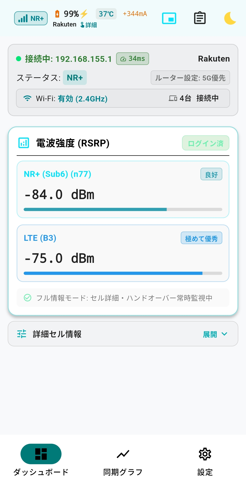
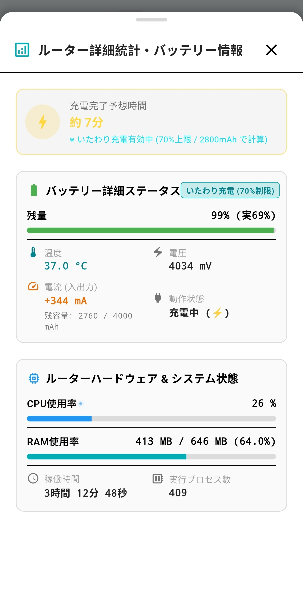
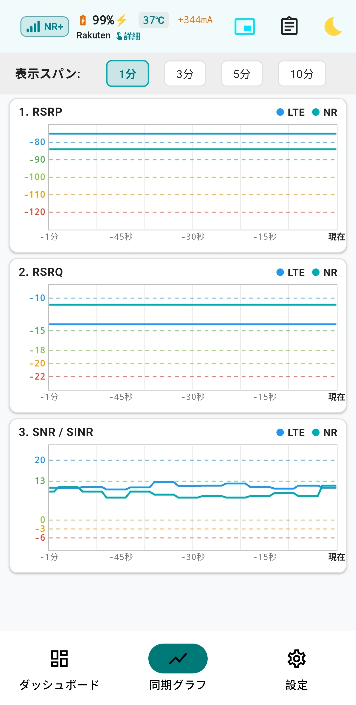
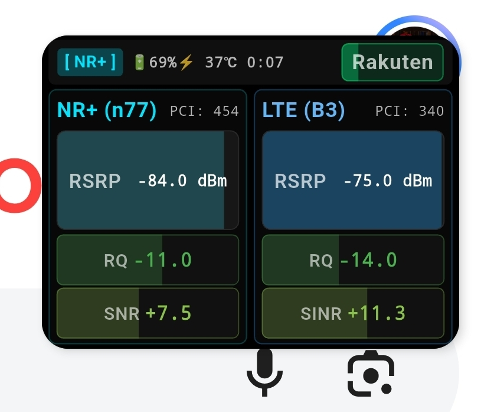
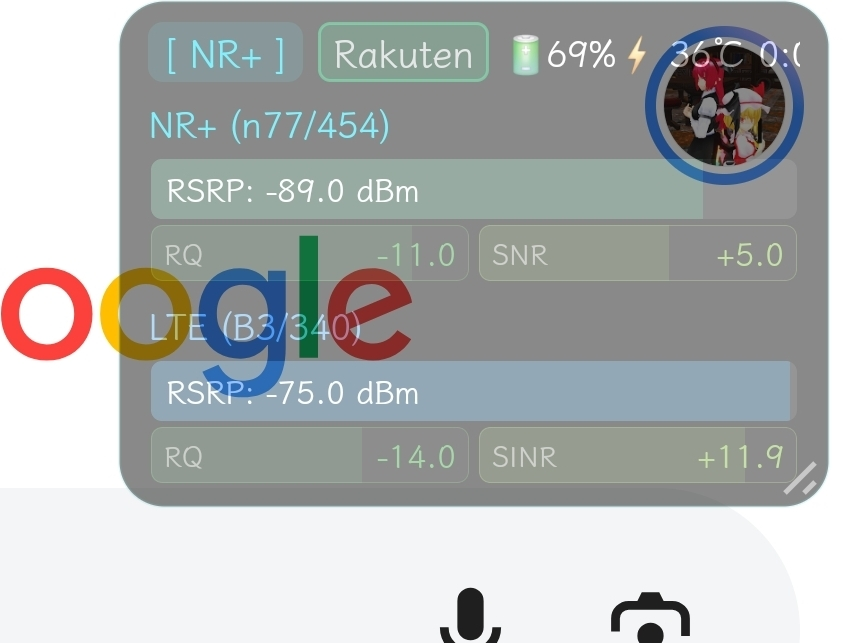
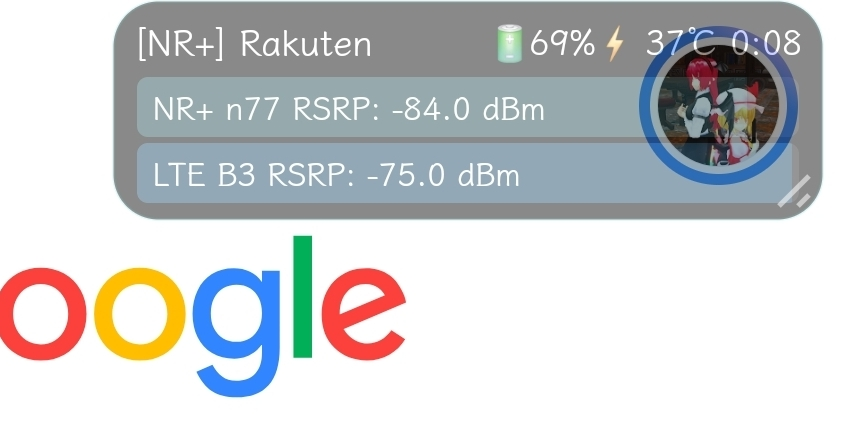

# +F FS050W Signal Display (FS050W 電波監視・エンジニアリング表示アプリ)

[](https://flutter.dev)
[-green.svg>)](https://www.android.com)
[](https://github.com/SyameimaruKoa/FS050W-Signal-Display/releases)

富士ソフト製 5G/4G モバイルルーター **「+F FS050W」** の電波状態・セル情報・バッテリー詳細・ハードウェア統計をリアルタイムに取得・可視化・常駐監視する Android アプリケーションです。

---

## 📸 スクリーンショット

|                 機能                 |                       スクリーンショット                       |
| :----------------------------------: | :------------------------------------------------------------: |
|   **ダッシュボード & 共通AppBar**    |      |
| **バッテリー・システム詳細モーダル** |  |
|            **同期グラフ**            |     |
|               **PiP**                |       |
|            **HUD mode 1**            |     |
|            **HUD mode 2**            |     |
|          **HUD mode mini**           |  |

---

## 📱 主な機能

### 1. 全画面共通 AppBar (`Fs050wAppBar`) & バッテリー・給電ステータス

- **全画面統一ヘッダー**: ダッシュボード、リアルタイム同期グラフ、設定画面の全画面で共通のAppBarを表示。
- **アンテナピクトアイコン**: 電波強度に応じたバー表示 + 5G/4G/e4G（または NR/LTE/eLTE）世代バッジを常時表示。
- **バッテリー & 給電簡易ステータス**:
  - 通常バッテリー駆動時: `🔋 100% ⚡ 39℃ 0mA` をコンパクトに表示。
  - **バッテリーレス（AC給電）運用時**: `[ 🔌 AC給電 ]` をシンプルかつ明瞭に表示（不要な温度・電流バッジは自動非表示化）。
  - いたわり充電（70%制限）有効時は70%を100%とした換算値で直感的に表示。
- **ワンタップ展開**: AppBarタイトルエリアをタップすることで「ルーター詳細統計・バッテリー情報」モーダルを素早く呼び出し可能。

### 2. ルーター詳細統計 & バッテリー情報モーダル (`BatterySystemDetailSheet`)

- **給電状態 / 残り予想稼働時間**:
  - バッテリー駆動時: バッテリー容量と充放電電流から計算。いたわり充電有効時は70%上限（2800mAh）を考慮して算出。
  - バッテリーレス運用時: 「🔌 外部電源駆動 (バッテリーレス)」と給電ステータスを表示。
- **バッテリー詳細ステータス**:
  - 残量プログレスバー（いたわり充電時は70%を100%換算 + 実残量表示）
  - バッテリー温度（℃）、電圧（V）、入出力電流（mA / 計算残容量 mAh）、動作状態（充電中/放電中/未装着）。
  - バッテリー未装着時は「🔌 バッテリー未装着 (AC給電駆動中)」とスッキリと表示。
- **ルーターハードウェア & システム状態**:
  - CPU使用率（%）プログレスバー
  - RAM使用率（使用量 MB / 総容量 MB、%）プログレスバー
  - 稼働時間（日・時間・分・秒）
  - 実行プロセス数

### 3. 公式アプリAPIへの全面改修 & 認証別リフレッシュレート

- **公式エンドポイント統合**:
  - `POST /action/get_mgdb_params`（電波品質 + バッテリー詳細）
  - `POST /action/get_device_state`（稼働時間、CPU、RAM、プロセス数）
- **ポーリングレートの分離**:
  - 実測に基づき、未ログイン時は1秒を無効化（3秒/5秒/10秒）。
  - ログイン時は1秒/2秒/3秒/5秒の超高速更新に対応。認証状態に応じてタイマーを動的切り替え。

### 4. リアルタイム電波ダッシュボード (Dashboard)

- **5G NR (Sub-6 / SA / NSA) & 4G LTE セル情報表示**:
  - RSRP（電波受信強度 / dBm）
  - RSRQ（受信信号品質 / dB）
  - SINR / SNR（信号対雑音比 / dB）
  - Band（n77, n78, n79, B1, B3, B8, B18, B19, B26, B28, B41, B42 等）および周波数（MHz）
  - PCI（Physical Cell ID）
  - 接続事業者（キャリア名）
- **6段階シームレスカラーゲージ**: 電波強度・品質を「極めて優秀」「良好」「普通」「やや弱い」「微弱」「圏外寸前」の6段階グラデーションで直感的に把握。
- **5G SA / NSA 自動判別**: 5G SA（Standalone）接続時は自動で不要な4Gアンカーセルカードを非表示化。
- **世代表記切り替え**: 「4G / 5G / e4G」表記と「LTE / NR / eLTE」表記を切り替え可能。
- **5G SNR補正切り替え**: FS050Wハードウェア特有の 5G SNR オフセット（-23dB）補正のON/OFFが可能。

### 5. イベントハプティクス & LED通知（通知用オーバーレイ）

- **最上部イベント LED ランプ**:
  - 5G突入時やハンドオーバー時に、画面最上部にパルス点灯する通知用オーバーレイを表示（スリムバー / 丸型LED、位置変更可能）。
  - 有効化時および点灯テスト時に「他のアプリの上に重ねて表示」権限の要求ダイアログが表示されます。
- **バッテリー高温警告**:
  - 設定温度（38℃〜50℃、デフォルト: 45℃）以上になった場合に赤色警告表示、Native 3連アラートバイブレーション、画面上部LEDランプをトリガー。
- **5G+ (Sub6) 突入 & 基地局ハンドオーバー検知**:
  - 5G Sub6 エリア突入時や基地局（PCI）切り替わり時に触覚フィードバック（バイブレーション）とお知らせ。

### 6. PiP (Picture-in-Picture) & フローティングオーバーレイ

- **PiP 7種アスペクト比対応**: 16:9, 9:16, 1:1, 4:3, 3:4, 21:9, 9:21 に対応。ホーム画面遷移時の自動小窓化にも対応。
- **フローティングオーバーレイ**: 他アプリ使用中も画面最前面に電波・バッテリー情報を常時フローティング表示（カード型 / コンパクト行型、透過度・サイズ調整可能）。
- **バッテリーレス表示対応**: 小窓・オーバーレイ内でもバッテリー未装着時は「🔌 AC給電」と表示。

### 7. リアルタイム同期タイムシリーズグラフ (Sync Graph)

- **3連時間軸同期チャート**: RSRP、RSRQ、SINR の推移を同一の時間軸で並べてリアルタイム描画。
- **スパン切り替え**: 1分・3分・5分・10分の表示期間をワンタップで切り替え可能。

### 8. 有機EL向け HUD 全画面常時表示モード (HUD Mode)

- **Immersive Fullscreen**: ナビゲーションバーやステータスバーを隠した完全全画面表示。
- **省電力・焼き付き防止**: ピュアブラック（True Black）背景と、有機ELディスプレイ（OLED）のピクセル焼き付きを防止する微細ジッター（Anti-burn-in）アニメーションを搭載。

---

## 既存の不具合

- PiPとオーバーレイを併用する際、オーバーレイがPiPサイズ以上表示されない問題

---

## 🔒 ログイン情報・バックアップ仕様について

### 全設定の自動バックアップ対応（Auto Backup & Device Transfer）

本アプリでは、アンインストール後の再インストール時やスマートフォンの機種変更時にもスムーズに利用できるよう、**アプリの全設定（ルーター接続情報・パスワード・PiP/オーバーレイ設定・通知設定など）が Android の自動バックアップ（Google ドライブ連携）および端末間データ移行（Device-to-Device transfer）の対象**となっています。

- **自動バックアップ対象**: `SharedPreferences`、データベース、ローカル設定ファイルを含む全データ
- **再インストール時の挙動**: Google アカウントに保存された前回の設定・ログイン情報が自動的に引き継がれます。
- **設定を完全に初期化（リセット）したい場合**:
  1. 端末の「設定」$\to$「アプリ」$\to$「FS050W Signal Display」を開く
  2. 「ストレージとキャッシュ」をタップ
  3. **「ストレージを消去（データを消去）」** を実行すると、バックアップデータを含め初期状態にリセットされます。

---

## 🛠 動作環境

**バージョン:** v2.1.2 (Release)  
**ターゲットOS:** Android 8.0 以上 (API 26+)  
**対応アーキテクチャ:** arm64-v8a, armeabi-v7a, x86_64

- Android 15 / 16 (One UI 7 / 8) 動作確認済み
- **対応ルーター**: 富士ソフト +F FS050W (Wi-Fi接続)
- **開発フレームワーク**: Flutter 3.0+ / Dart 3.0+

本開発で解析した通信方法はdocs内にあるGistリポジトリにあります。

---

## 🚀 ビルドとインストール

### 1. リポジトリのクローン

```bash
git clone https://github.com/SyameimaruKoa/FS050W-Signal-Display.git
cd FS050W-Signal-Display
```

### 2. 依存パッケージの取得

```bash
flutter pub get
```

### 3. リリースAPKのビルド

```bash
# アーキテクチャ別（ABI別）分割ビルド（推奨: ファイルサイズ大幅削減）
flutter build apk --release --split-per-abi
```

生成されたAPKファイルは `build/app/outputs/flutter-apk/` に出力されます：

- `app-arm64-v8a-release.apk`: 最近の一般的な64bit Androidスマートフォン向け（推奨）
- `app-armeabi-v7a-release.apk`: 古い32bit Android端末向け
- `app-x86_64-release.apk`: エミュレーター / PC向け

---

## GitHub Actionsによるビルド・公開

`Android CI` はPR作成・更新、`main`へのpush、Actions画面からの手動実行に対応します。
PRと`main`へのpushでは、アプリ本体（`lib/`、`android/`、`assets/icons/`）、テスト、
依存関係（`pubspec.yaml` / `pubspec.lock`）、解析設定、Android用Actions設定に変更がある場合だけ実行します。
README・更新履歴・スクリーンショットだけの変更や、Androidの生成済みビルド／Gradleキャッシュの変更では実行しません。
Actions画面からの手動ビルドと、公開タグpushによる `Android Release` は変更ファイルに関係なく実行します。
Flutter 3.47.1 / Java 17で依存関係をロックファイルどおりに取得し、`flutter test` 成功後に
デバッグAPKとABI別リリースAPKを生成します。Actionsの実行結果にある **Artifacts** から
14日間ダウンロードできます。PRのリリースAPKは動作確認用のデバッグ署名です。

`Android Release` は `vX.Y.Z` 形式のタグをpushすると、テスト・署名済みABI別APKのビルドを行い、
APKと `SHA256SUMS.txt` を添付したGitHub Releaseを公開します。既存Releaseがある場合は添付ファイルを更新します。
バージョン名はタグ（例: `v2.2.8` → `2.2.8`）、AndroidのversionCodeは
`1000 + Android Releaseのrun_number` になります。同じ実行の再実行ではversionCodeも同じです。
ワークフローを作り直す場合は、公開済みversionCodeを上回るようにオフセットを調整してください。

### 署名キーの新規作成（Windows PowerShell）

既存の公開APKと同じ鍵で更新する場合は、新規作成せず、そのAPKに使用したキーストアを使用してください。
新しい署名キーを作る場合は、Java JDKまたはAndroid Studioに付属する `keytool` を使います。
以下は [Flutter公式のキーストア作成手順](https://docs.flutter.dev/deployment/android#create-an-upload-keystore) に沿った例です。

まず、リポジトリの外に保存用フォルダーを作成します。

```powershell
New-Item -ItemType Directory -Force -Path "$env:USERPROFILE\fs050w-signing"
```

次のコマンドで `release.jks` を作成します。すでに同名のファイルがある場合は再作成せず、既存の鍵を確認してください。

```powershell
keytool -genkeypair -v -keystore "$env:USERPROFILE\fs050w-signing\release.jks" -storetype JKS -keyalg RSA -keysize 2048 -validity 10000 -alias fs050w-release
```

`keytool` が見つからない場合は、Android Studio付属の実行ファイルを指定します。
インストール先が異なる場合はパスを変更してください。

```powershell
& 'C:\Program Files\Android\Android Studio\jbr\bin\keytool.exe' -genkeypair -v -keystore "$env:USERPROFILE\fs050w-signing\release.jks" -storetype JKS -keyalg RSA -keysize 2048 -validity 10000 -alias fs050w-release
```

実行すると、キーストアのパスワード、証明書の名前・組織・国コードなど、最後に鍵のパスワードが対話形式で求められます。
パスワード入力中は文字が表示されません。キーストアと鍵のパスワードは6文字以上にし、パスワード管理ツールなどに保存してください。
鍵のパスワードでEnterを押すと、キーストアと同じパスワードになります。
証明書の情報を確認して承認すると作成されます。エイリアスはこの例では `fs050w-release` です。

`release.jks` とパスワードは、今後の更新でも同じものを使うため、安全な場所にバックアップしてください。
キーストアやパスワードをリポジトリにコミットしないでください。

### GitHub Secretsへの登録

公開前に、リポジトリの **Settings → Secrets and variables → Actions → New repository secret** で以下を1項目ずつ登録します。

| Secret | 内容 |
| --- | --- |
| `ANDROID_KEYSTORE_BASE64` | 署名キーストアのBase64文字列 |
| `ANDROID_KEYSTORE_PASSWORD` | キーストアのパスワード |
| `ANDROID_KEY_ALIAS` | 署名鍵のエイリアス |
| `ANDROID_KEY_PASSWORD` | 署名鍵のパスワード |

上記のコマンドで新規作成した場合、`ANDROID_KEY_ALIAS` は `fs050w-release`、
`ANDROID_KEYSTORE_PASSWORD` は作成時のキーストアパスワード、`ANDROID_KEY_PASSWORD` は鍵のパスワードです。
鍵のパスワード入力をEnterで省略した場合は、両方のパスワードSecretに同じ値を登録します。
`ANDROID_KEYSTORE_BASE64` は、次のコマンドでコピーした文字列をそのままSecretの値に貼り付けます。

```powershell
[Convert]::ToBase64String([IO.File]::ReadAllBytes("$env:USERPROFILE\fs050w-signing\release.jks")) | Set-Clipboard
```

Windows PowerShellでキーストアをBase64に変換する例:

```powershell
[Convert]::ToBase64String([IO.File]::ReadAllBytes('C:\secure\release.jks')) | Set-Clipboard
```

既存APKから上書き更新できるように、これまでの公開APKと同じ署名鍵を使用してください。
従来のローカルビルドはデバッグ鍵で署名しているため、そのAPKの利用者が更新するには
元の開発環境のデバッグキーストアを登録するか、新しい鍵へ移行する際に再インストールが必要です。
Secretsが未設定なら公開ビルドは失敗し、Releaseは作成されません。
署名鍵はPRのビルドには渡されません。

公開例（ワークフローを含む変更がGitHubに反映された後に実行）:

```bash
git tag v2.2.8
git push origin v2.2.8
```

ローカルのリリースビルドでも `ANDROID_KEYSTORE_PATH`（絶対パス）、
`ANDROID_KEYSTORE_PASSWORD`、`ANDROID_KEY_ALIAS`、`ANDROID_KEY_PASSWORD` を設定すると
同じ鍵で署名できます。未設定時は従来どおりデバッグ署名を使用します。

## 📝 更新履歴

詳細な全バージョンの更新履歴は [CHANGELOG.md](CHANGELOG.md) をご覧ください。
